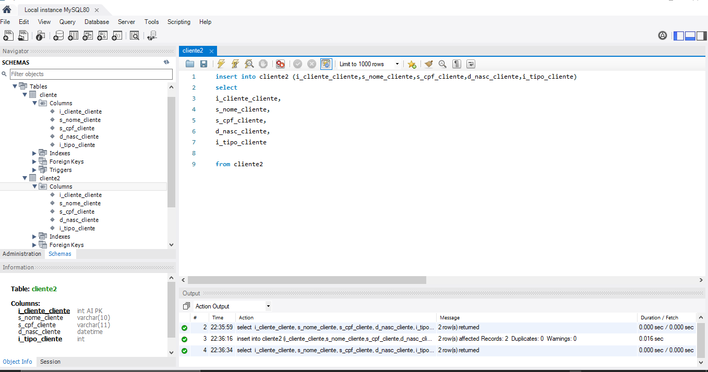
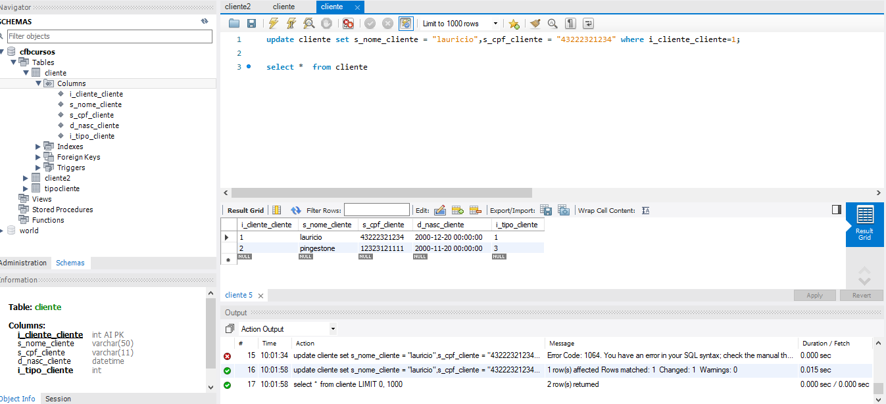
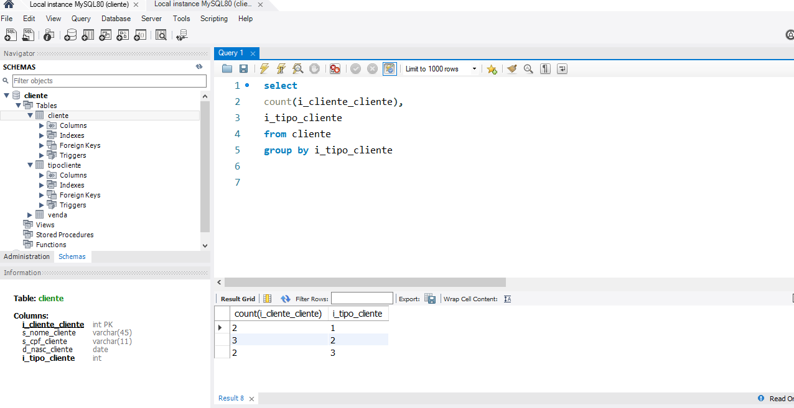
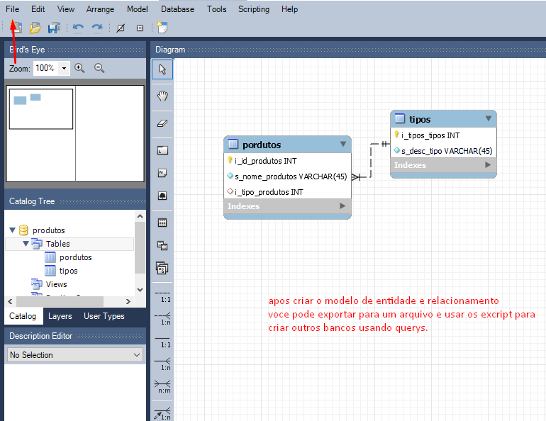
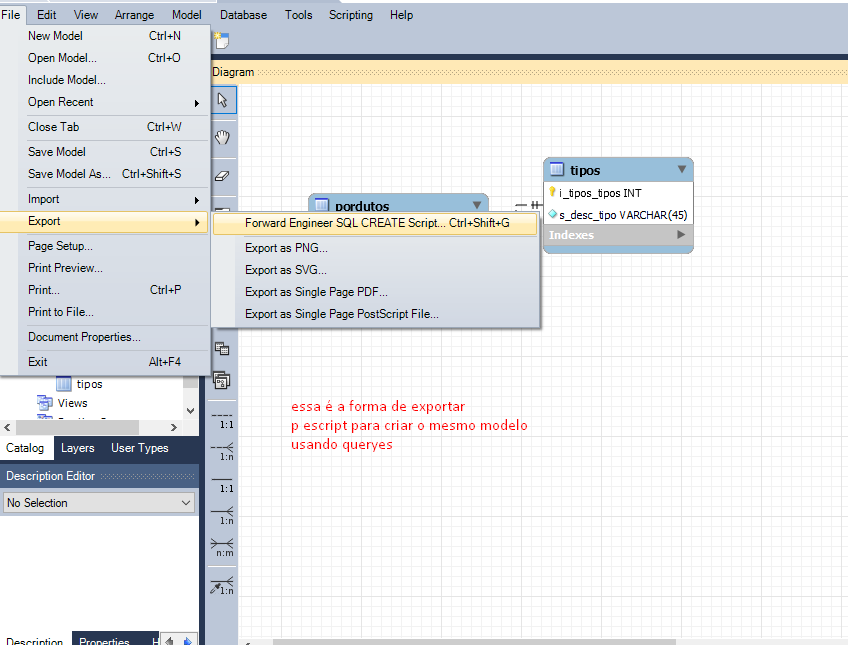
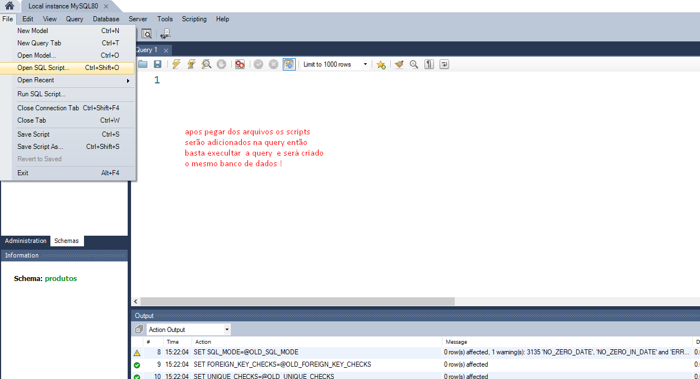
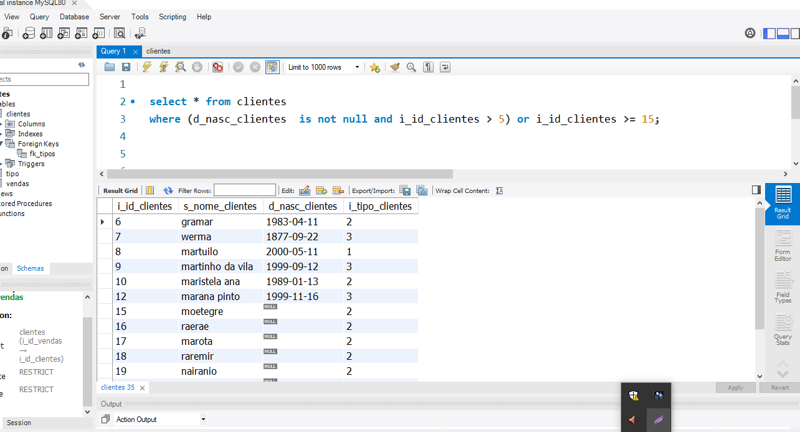

# curso-de-sql
curso de sql com  professor bruno cfb curso

## chave estrangeira

alter table clientes add constraint fk_tipo_cliente foreign key
(i_tipo_cliente)references tipocliente (i_tipo_tipocliente);

Como funciona foreign key mysql?
A chave estrangeira, ou foreign key, é um conceito ligeiramente diferente.
...
Diferentemente da chave primária, a chave estrangeira:
Pode ser nula (NOT NULL);
É um campo em uma tabela que faz referência a um campo que é chave primária em outra tabela;
É possível ter mais de uma (ou nenhuma) em uma tabela.

sintaxe 
 
 alter table clientes add constraint fk_tipo_cliente foreign key
(i_tipo_cliente)references tipocliente (i_tipo_tipocliente);

# insert dml

## insert

para  inserir uma coluna em uma tabela use 
# alter table cliente add column i_tipo_cliente int not null

para inserir um dado em uma coluna use

## insert into "nome da tabela" values ("aqui insira os valores que serão adicionados na mesma ordem da coluna");

veja os exemplos abaixo

/*
insert into tipocliente values (01,"pessoa fisica");
insert into tipocliente values  (02,"pessoa juridica");
insert into tipocliente values (03,"cliente especial");
*/

/*
insert into cliente values (01,"mariscleia","11111111111","2000-12-20",01);
insert into cliente values (02,"jurinalva","11111111113","2000-11-20",03);
*/

caso seja adicionado um dado em uma coluna especifica basta especificar a coluna antes do parametro "values"

# Alterando nome da coluna 

ALTER TABLE nomes_clientes 
RENAME COLUMN primeiro_nome TO nome, 
RENAME COLUMN segundo_nome TO sobrenome;

#como ver essee dados que foram inseridos ?

para isso usaremos DQL (data query language)

## select

select * from ("nome da tabela);

usar o (" * ") significa pegar todas as colunas dentro da tabela
para especificar a coluna basta apenas substituir o * pelo numero da coluna

# fazendo inserção multipla

para fazer uma inserção multipla voce precisa usar inser em conjunto com o select 

insert into cliente2 (i_cliente_cliente,s_nome_cliente,s_cpf_cliente,d_nasc_cliente,i_tipo_cliente)
select 
i_cliente_cliente,
s_nome_cliente,
s_cpf_cliente,
d_nasc_cliente,
i_tipo_cliente

from cliente2

# update 
é usado para modifcar registros de uma coluna

update cliente set s_nome_cliente="lauricio" where i_cliente_cliente=1;

# delete 
para deletar use a sintaxe 

delete from cliente where i_cliente_cliente > 0

para deletar um registro especifico basta usar as condições

# select 

voce pode selecionar quais registros ver e para isso use a sintaxe

select upper(s_nome_cliente),s_cpf_cliente from cliente 

como voce pode ver acima voce pode passar mais de um registro como parametro apos o select ;

# alias 

é uma forma de dar apelidos aos registros afim de facilitar as buscas e o uso nas funções

para usar o alias use a sintaxe

select s_nome_cliente as nome_dos_clientes from cliente 

voce tambem pode na mesma sintaxe atribuir um nome a tabela
para isto basta adicionar logo apos o nome da tabel o nome apelido(alias)
e lembre-se de voltar ao nome da coluna e atribuir o nome alias e ponto como no exemplo abaixo

select tbc.s_nome_cliente as nome_dos_clientes from cliente tbc

# distinct

serve para remover registros duplicados de uma coluna
para isso use a sintaxe 

select distinct i_cliente_cliente from cliente 

# subselect 

trata-se da possibilidade de adicionar operações como um parametro de um insert 
veja a sintaxe a baixo ;

operação:

select max(c.i_cliente_cliente)+1 as i_cliente_cliente from cliente c

esta opéração acia será passada como um parametro de uma inserção veja a seguir

insert into cliente values (select max(
    c.i_cliente_cliente)+1 as i_cliente_cliente from cliente c,
    "lauricio de souza","09871232135","2010-03-01",4);
 )
<<<<<<< HEAD

 ##     INNER JOIN 

 trata se a da possibilidade de adicionar em uma consulta a junção de uma coluna que estaja em outra tabela;

;

tambem podemos fazer varios inner jois na mesma consulta 
;

# group by

trata se da possibilidade de agrupar registros que se repetem 
e atraves da função count mostrar a quantidade

;

atenção isso é importante;

adicionando inner join

select 
count(i_cliente_cliente) as qtd,
s_desc_tipocliente
from cliente
inner join tipocliente on i_tipo_tipocliente = i_tipo_cliente
group by i_tipo_cliente

reversão do join 

select 
tc.s_desc_tipocliente,
count(c.i_cliente_cliente) as qtd
from
tipocliente as tc
inner join cliente c on tc.i_tipo_tipocliente  = c.i_tipo_cliente
group by tc.i_tipo_tipocliente

# group by 

;

# modelos de entidade e relacionamento

o  modelo de entidade e relacionamento e usado para a criação de bancos de forma mais rapida e eficiente e temdo uma melhor visão 

ex;

### como na foto voce pode criar varios modelos e depois exportar o escript para 
criar outros bancos usando queryes  
veja o exemplo abaixo;

# passo 01
]

# passo 02

 # null VS is not null

usaremos esses dois tipos de dados quando precisar-mos informar
que um dado é vazio ou diferente de vazio

isso é muito usado para fazer requisições

exemplo: Digamos que em um tabela eu tenha uma coluna com varios registros
e entre eles alguns vazios (null). Então para filtrar em uma consulta apenas os registros
vazios usamos  a seguinte sintaxe.

### select * from clientes 

### where d_nasc_clientes IS NULL ;

"lembre-se ao direcionar uma tabela ao tipo de registro em uma consulta nao usa-se o sinal de igualdade apenas o IS NULL"

  agora imagine que fosse o oposto e você precisa-se filtrar apenas os registro que estivessem preenchidos.

então meu caro neste caso você deve usar o 

 ### is not null 

isso iria indicar que é diferente de vazio

# AND, OR e NOT

## AND 
Através dessa tag podemos passar mais de uma condição em nossas consultas
imagine que você prcise  filtrar em uma consulta os que sejam do plano basico e que também tenha a data de
vencimento  no mes 09.

é nesta situação em usamos o " AND " pois ele ira permitir que possamos passar mais de uma condição

e aqui vai uma detalhe muito importante !!!

### para que a pesquisa traga o resultado ambas as condições devem ser verdadeiras!

## OR 
Este é bem facil de lidar pois é muito semelhante ao a tag vista acima oque muda é apenas o fato
de que a nossa consulta feita com "OR" trara resultados mesmo se uma das condições nao for cumprida

então ele funcionará da seguinte forma: 
 digomamos que você queira filtrar pelo id do cliente maior que 10 e tambem se o campo data esta nullo.

 então voce deve usar o "or" da seguinte forma.

 ### select * from clientes 
 ### where  i_id_cliente > 10 OR d_data_cliente IS NULL;

 então esta seria a consulta. Como primeira instacia de resutado ele iria passar todos os id's de clientes 
 que fossem maior que dez e logo apos esses resultados ele iria mostrar os campos de datas que estivessem vazios.

 nao a limites para o uso de condições 
 é possivel  fazer com que condições acontecam antes
 usando parentese nas condições que deverão ser execultadas antes

 veja na imagem a seguir

 

 ## NOT
 Trata-se da negação de um determinado registro 
 digamos que voce precise de alguma forma filtrar uma data todos os clientes menos 
 os que tenha cadatro no mes 09;

 para fazemos essaconsulta usamos a seguinte sintaxe

### select * from clientes
### where  NOT mont(d_data_cliente) = 09;

na sintaxe acima estou informando que quero todos os clientes menos aqueles 
que tenha cadastro no mes 09;

# TOP vs LIMIT

Usamos para limitar osresultados de nossas consultas
essa é uma sintaxe que varia muito de acordo com a linguagem e banco de dados 
então deixarei aqui as duas formas relacionadas ao que estou estudando, que é
 MYsql e sql server.

## MYSQL
usamos a seguinte sintaxe:
### select * from clientes limit 5

a sintaxe acima resultará em uma consulta limitada aos 5 primeiros registros

## SQL SERVER
### select top 5, * from clientes

a sintaxe acima resultará em uma consulta limitada aos 5 primeiros registros

# max e min

com esses operadores podemos obter os valores maximos e minimos de uma coluna 
sintaxe:   
max(nome_da_coluna)

min(nome_da_coluna)

# funções ROUND, SUM, AVG, COUNT

## ROUND 
com ele podemos arredondar numeros quebrados 
sintaxe 

round("nome_coluna",2)

acima o numero apos a virgula significa a quantidade 

de casas decimais apos o virgula no valor retornado.

## SUM 
podemos realzar somos de registros de uma mesma tabela

sintaxe:

sum("nome_coluna")

## AVG (average)
serve para obter a media de valores passados em uma consulta

sintaxe:

avg("nome_coluna")

### OBS:

todas as funções acima podem ser passados 
como paramaretro de outra 
exemplo:

select avg(sum("nome_coluna")) from clientes

select round(avg(sum("nome_coluna")),2) from clientes

# LIKE

o operador like serve para apurarmos nossoas consultas de forma mais 
especifica.

atraves dele pode filtrar pela quantidade de caracteres e tambem pelo
proprip caractere ;

## obs:
usamos o " % " para indicar que o caracterwe apos pode ser qualquer um
  
exemplos:

1_   select s_nome_cliente from clientes 
where nome_coluna like("A%")

2_ select s_nome_cliente from clientes 
where nome_coluna like("%A")

acima no exemplo 1 estou dizendo em nossa consulta
que quero filtrar apenas valores que comecem com a letra "A";

acima no exemplo 2 estou dizendo em nossa consulta
que quero filtrar apenas valores que terminam com a letra "A";

## obs:

usamos o " _ " para indicar a quantidade de caracters em nossa consulta
exemplo: 

select s_nome_cliente from cliente where like("_____")

acima estou informando em minha consulta que quero apenas os registros que tenham 
5 caracteres;

# usando o operador IN

esse operador serve para sermos mais especificos em nossas consultas
dispensando o uso do and ;

## exemplo digamos que eu tenha que fazer uma consulta que retorne apenas os 3 ultimos caracteres de um cpf 

 veja abaixo o uso do IN para esta consulta;

 select * from clientes 
 where right(s_cpf_clientes,3) in (111,222,333)

 a consulta acima deve me retornar apenas  os cpfs de clientes que tenham como ultimos tres numeros 1,2 ou 3 .

 ### OBS: podemos tambem passar subselects como parametro de um IN  

#between 

com ele podemos fazer consultas que irão retornar valores que estejam entre determinadascondições ;
ex:
## digamos que eu tenha que filtar em uma consulta valores que estejam entre 1 e 5 entao para esta consulta iria usar a seguinte sintaxe;

select * from clients 
where i_id_clientes between 1 and 5;

isso iria retornar clietes de id 1 A 5;

