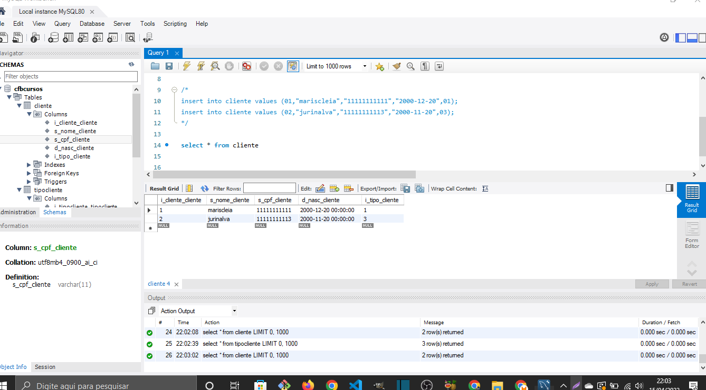

# curso-de-sql
curso de sql com  professor bruno cfb curso

#insert dml

##insert

para inserir um dado em uma coluna use

##insert into "nome da tabela" values ("aqui insira os valores que serão adicionados na mesma ordem da coluna");

veja os exemplos abaixo

/*
insert into tipocliente values (01,"pessoa fisica");
insert into tipocliente values  (02,"pessoa juridica");
insert into tipocliente values (03,"cliente especial");
*/

/*
insert into cliente values (01,"mariscleia","11111111111","2000-12-20",01);
insert into cliente values (02,"jurinalva","11111111113","2000-11-20",03);
*/

caso seja adicionado um dado em uma coluna especifica basta especificar a coluna antes do parametro "values"

#como ver essee dados que foram inseridos ?

para isso usaremos DQL (data query language)

##select

select * from ("nome da tabela);

usar o (" * ") significa pegar todas as colunas dentro da tabela
para especificar a coluna basta apenas substituir o * pelo numero da coluna

#fazendo inserção multipla

para fazer uma inserção multipla voce precisa usar inser em conjunto com o select 

insert into cliente2 (i_cliente_cliente,s_nome_cliente,s_cpf_cliente,d_nasc_cliente,i_tipo_cliente)
select 
i_cliente_cliente,
s_nome_cliente,
s_cpf_cliente,
d_nasc_cliente,
i_tipo_cliente

from cliente2

#update 
é usado para modifcar registros de uma coluna

update cliente set s_nome_cliente="lauricio" where i_cliente_cliente=1;

